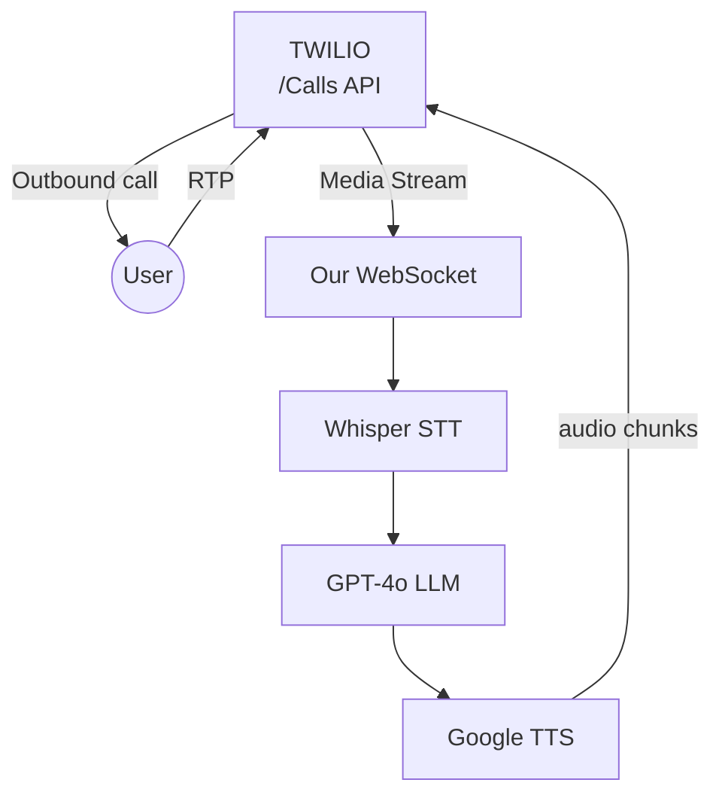

# wake-up-call

# 🛏️ Problem & Opportunity

- **Snooze epidemic** – 1 in 3 adults hit snooze 2-plus times every morning  
- **Alarms get muted / ignored** → lateness, missed productivity  
- **Solution:**  
  1. Phone *calls* you at the exact alarm time  
  2. AI voice chats until you’re verbally awake  
  3. Keeps redialing if you don’t answer or hang up before 2 mins
- **Why it’s exciting for us:** simple concept, real revenue, rich streaming data to engineer

---

# 📞 Solution in one diagram

1. Scheduler triggers **Twilio /Calls** API  
2. TwiML <Start><Stream> pipes audio to our WebSocket
3. Pipeline: STT ➜ LLM ➜ TTS (≤ 1 s)
4. Twilio plays reply; loop until wake-confirmed

---

## 💰 Economics at a Glance

| Component        | Cost / min |
|------------------|-----------:|
| Twilio voice     | **$0.013** |
| Streaming STT    | **$0.026** |
| Streaming TTS    | **$0.002** |
| GPT-4o tokens    | **$0.001** |
| **Total COGS**   | **≈ $0.04** |

**Pricing target:** $12 / mo → ~60 min of calls  
*Gross margin ≈ 76 %*  
Break-even per call ≈ $0.13 @ 70 % margin.

---

## 🔧 Data-Engineering Playground

- **Real-time streaming** — WebSocket framing, back-pressure, sub-second SLA  
- **Multi-modal pipeline** — audio → text → tokens → audio  
- **Analytics** — Twilio webhooks → Kafka / warehouse → Grafana (wake-rate & latency)  
- **Cost telemetry** — per-utterance token + second metering  
- **Compliance** — consent logs, opt-outs, recording retention  

Perfect for flexing everything we learned in bootcamp.

---

## 🗺️ Six-Weekend Roadmap

| Week | Milestone |
|------|-----------|
| **1** | “Hello-world” call plays greeting |
| **2** | STT → GPT → TTS round-trip < 1 s |
| **3** | Alarm scheduler + redial logic |
| **4** | Stripe metered billing & dashboard |
| **5** | Voice Insights + Grafana metrics |
| **6** | Closed alpha with 10 real users |

### Roles (rotating)
- Voice Ops · AI Pipeline · Data & Observability  
- Web/Billing · PM/Compliance  

**Commitment:** one sprint demo each Friday night.  
If we’re still pumped after 6 weeks → public launch!
